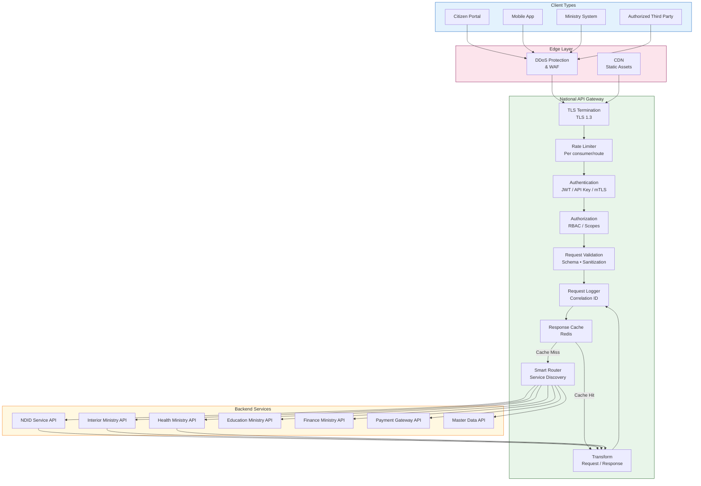
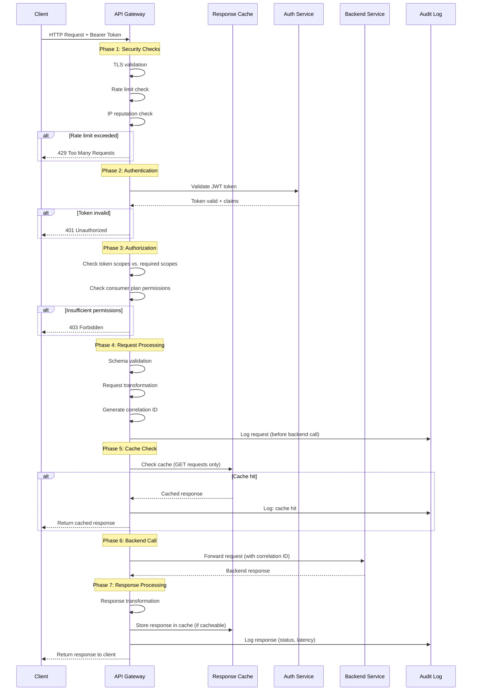
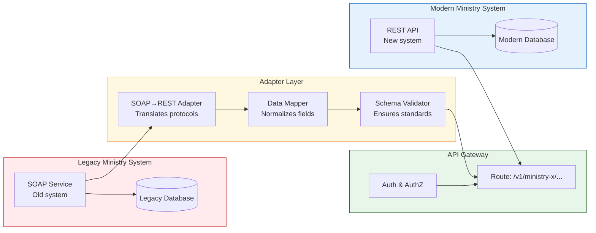
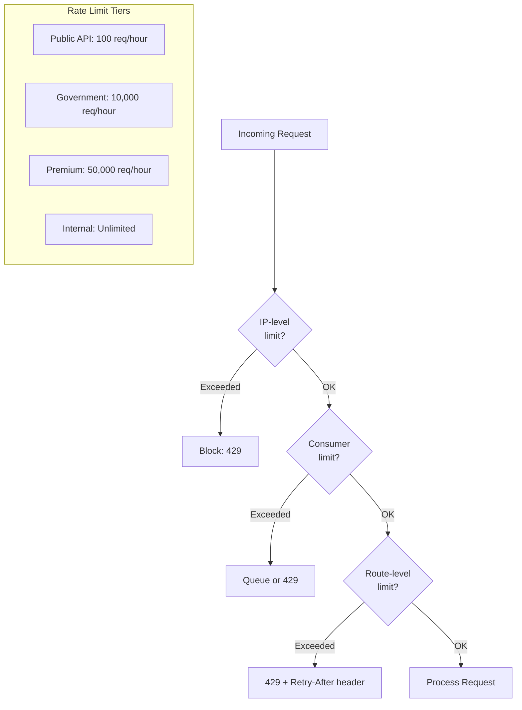

# API Gateway Flow
**National API Gateway — Request Processing Architecture**

## 1. Request Routing Architecture

---

## 2. API Request Lifecycle

---

## 3. Ministry Integration Pattern

---

## 4. Rate Limiting Strategy

