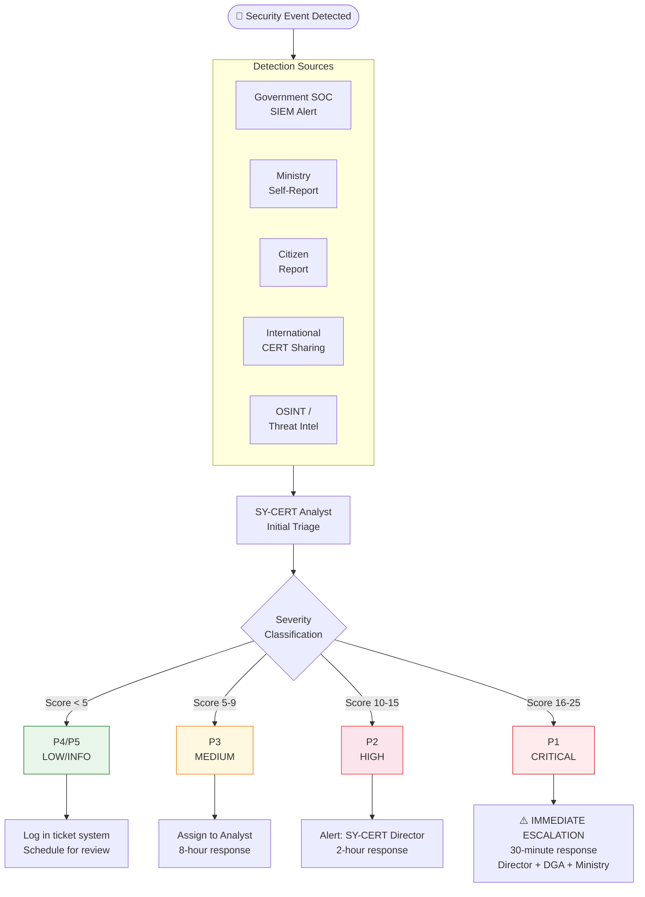
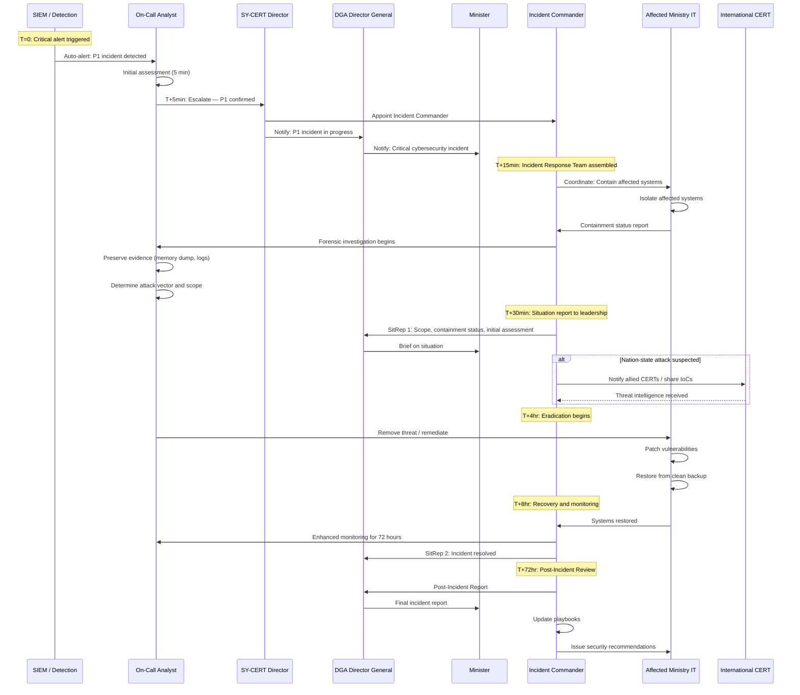
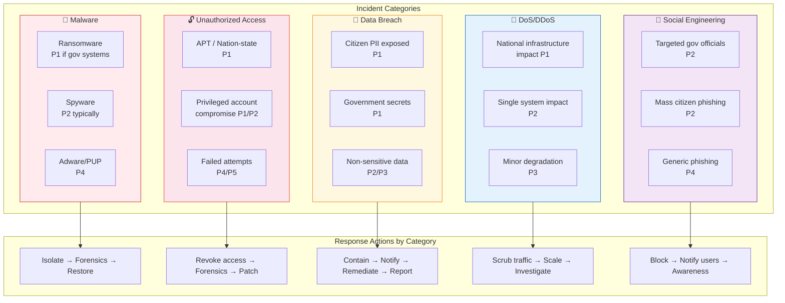
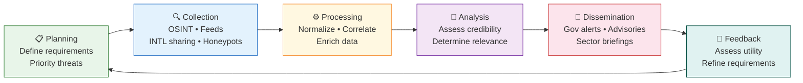

# CERT Incident Response Flow
**SY-CERT — Cybersecurity Incident Response Procedures**

## 1. Incident Detection and Triage

---

## 2. P1 Critical Incident Response Flow

---

## 3. Incident Classification Matrix

---

## 4. Threat Intelligence Cycle

