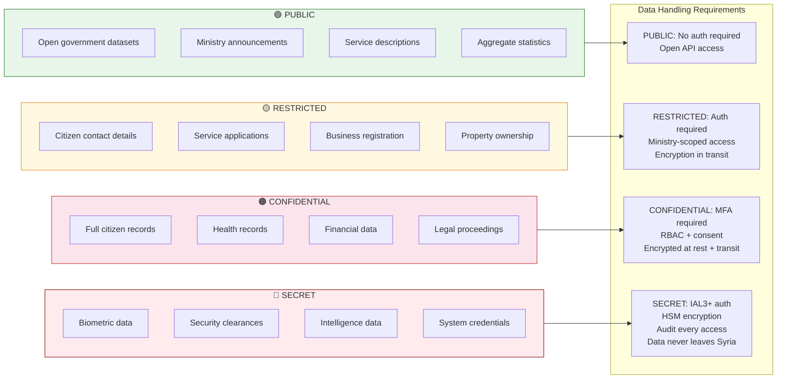
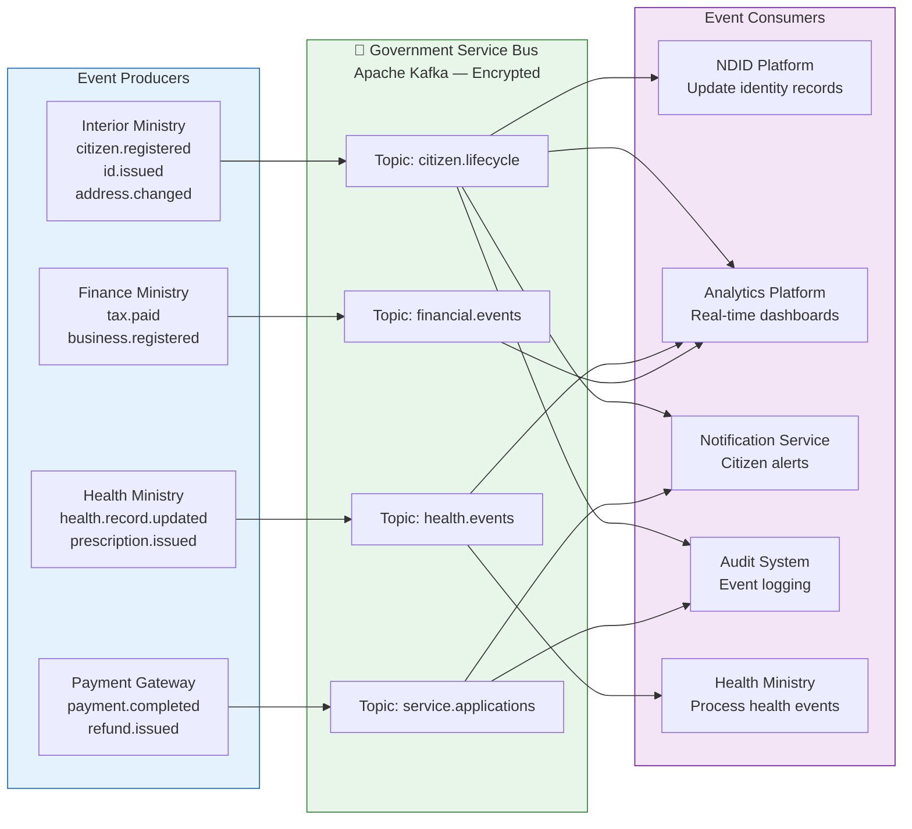
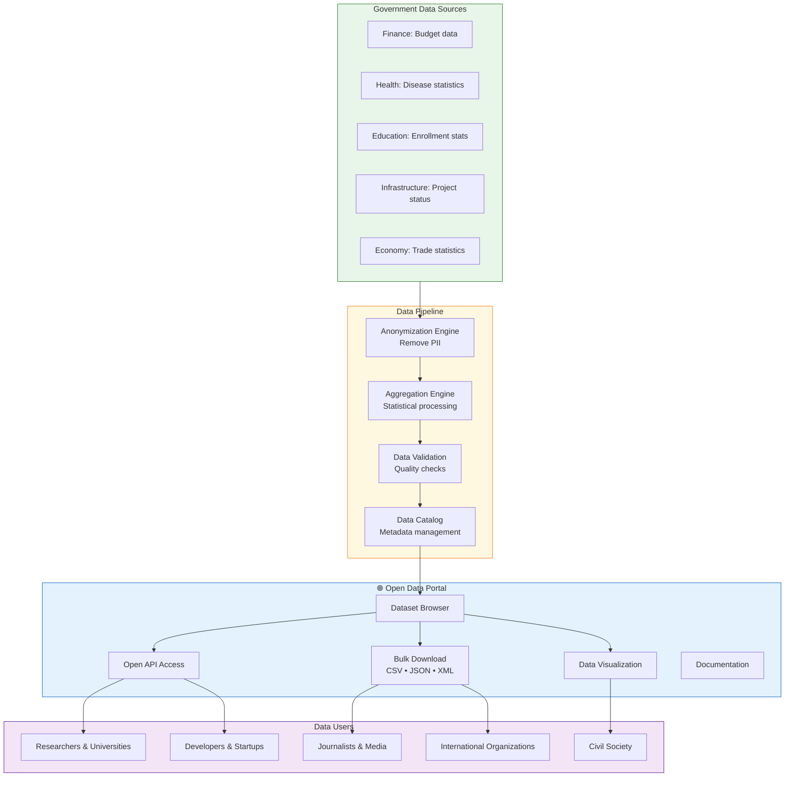

# Data Exchange Model
**Government Data Interoperability Architecture**

## 1. Master Data Management Model

```mermaid
graph TB
    subgraph AUTHORITATIVE["📋 Authoritative Registries (Single Source of Truth)"]
        CIVIL[Civil Registry<br/>Ministry of Interior<br/>Birth • Death • Marriage • Nationality]
        BIZ_REG[Commercial Registry<br/>Ministry of Economy<br/>Business Registration]
        PROP_REG[Property Registry<br/>Ministry of Justice<br/>Land & Buildings]
        VEH_REG[Vehicle Registry<br/>Ministry of Transport<br/>Vehicles & Licenses]
        HEALTH_REG[Health Registry<br/>Ministry of Health<br/>Medical Records]
        EDU_REG[Education Registry<br/>Ministry of Education<br/>Credentials & Enrollment]
    end

    subgraph MASTER["🗄️ DGA Master Data Hub"]
        CITIZEN_MDM[Citizen MDM<br/>Consolidated view from Civil Registry]
        BIZ_MDM[Business MDM<br/>Consolidated view from Commercial Registry]
        LINK_ENGINE[Identity Linking Engine<br/>Cross-registry correlation]
        DATA_QUALITY[Data Quality<br/>Deduplication • Validation]
    end

    subgraph API_LAYER["🔌 Data Access Layer"]
        DATA_API[Master Data API<br/>/v1/citizens/{NIN}<br/>/v1/businesses/{CRN}]
        CONSENT_SVC[Consent Service<br/>Data sharing permissions]
        AUDIT_LOG[Immutable Audit Log<br/>Every data access recorded]
    end

    subgraph CONSUMERS["🏛️ Data Consumers (with authorization)"]
        MOH_C[Health Ministry<br/>Verify eligibility]
        MOE_C[Education Ministry<br/>Verify enrollment]
        MOF_C[Finance Ministry<br/>Tax compliance]
        PAYMENT[Payment Gateway<br/>Identity verification]
        POLICE[Interior — Police<br/>Identity verification]
    end

    CIVIL --> CITIZEN_MDM
    BIZ_REG --> BIZ_MDM
    CITIZEN_MDM --> LINK_ENGINE
    BIZ_MDM --> LINK_ENGINE
    LINK_ENGINE --> DATA_QUALITY
    DATA_QUALITY --> DATA_API
    CONSENT_SVC --> DATA_API
    DATA_API --> AUDIT_LOG

    DATA_API --> MOH_C
    DATA_API --> MOE_C
    DATA_API --> MOF_C
    DATA_API --> PAYMENT
    DATA_API --> POLICE

    style AUTHORITATIVE fill:#e8f5e9,stroke:#2e7d32
    style MASTER fill:#e3f2fd,stroke:#1565c0
    style API_LAYER fill:#fff8e1,stroke:#f57f17
    style CONSUMERS fill:#f3e5f5,stroke:#6a1b9a
```

---

## 2. Data Classification Model



---

## 3. Event-Driven Data Exchange



---

## 4. Open Data Architecture


