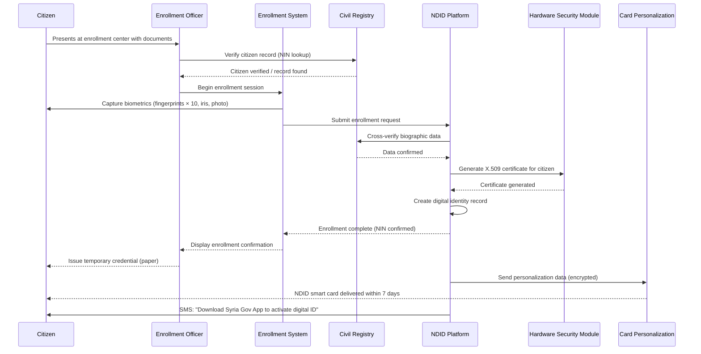
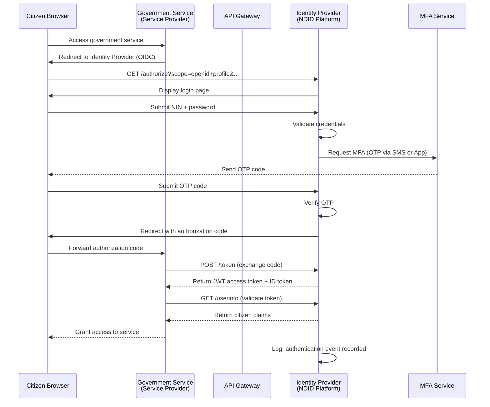
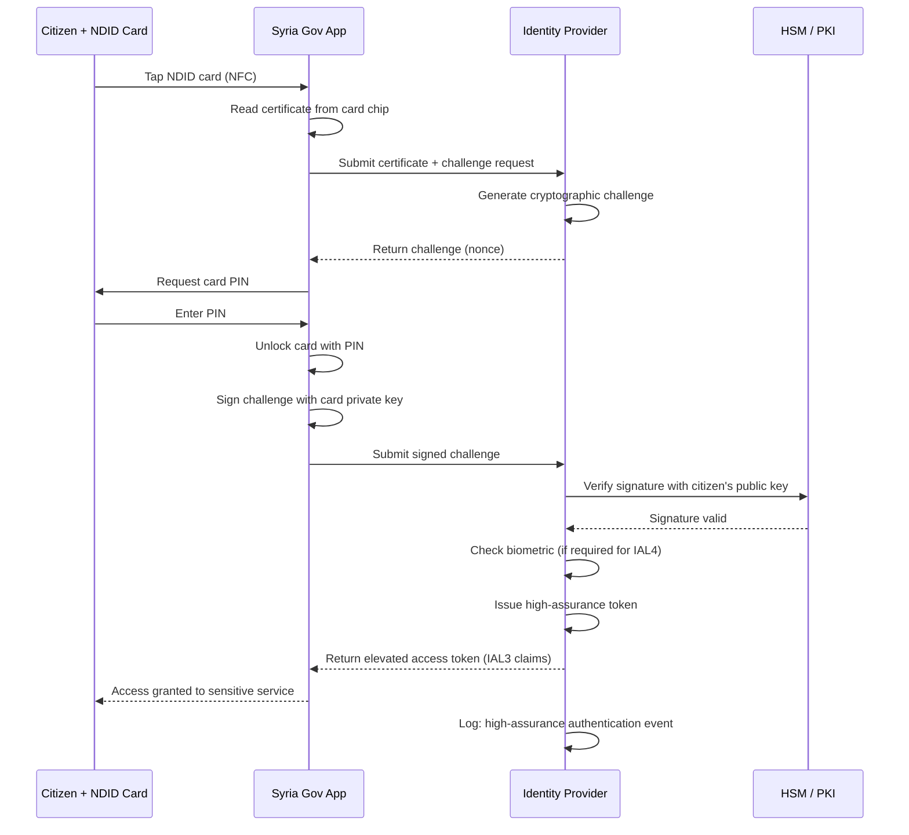
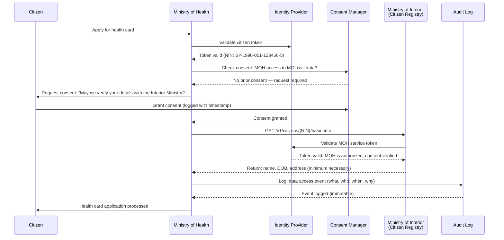

# Digital Identity Flow
**NDID Authentication and Authorization Flows**

## 1. Citizen Enrollment Flow

---

## 2. Standard Authentication Flow (IAL2)

---

## 3. High-Security Authentication Flow (IAL3 — Smart Card)

---

## 4. Cross-Ministry Data Sharing Authorization

---

## 5. Identity Levels Summary

```mermaid
graph LR
    subgraph IAL1["IAL1 — Basic"]
        A1[Username + Password]
        B1[Information lookup<br/>Status checks<br/>Public data]
    end

    subgraph IAL2["IAL2 — Standard"]
        A2[Password + OTP<br/>or App authenticator]
        B2[Service applications<br/>Form submissions<br/>Non-sensitive requests]
    end

    subgraph IAL3["IAL3 — High"]
        A3[NDID Card NFC<br/>+ PIN + Biometric]
        B3[Payment authorization<br/>Legal documents<br/>Sensitive data access]
    end

    subgraph IAL4["IAL4 — Maximum"]
        A4[In-person verification<br/>+ Biometric + Card]
        B4[Passport<br/>Property transfer<br/>High-value transactions]
    end

    IAL1 --> IAL2 --> IAL3 --> IAL4

    style IAL1 fill:#e8f5e9,stroke:#2e7d32
    style IAL2 fill:#fff8e1,stroke:#f57f17
    style IAL3 fill:#fce4ec,stroke:#c62828
    style IAL4 fill:#fbe9e7,stroke:#870000
```

