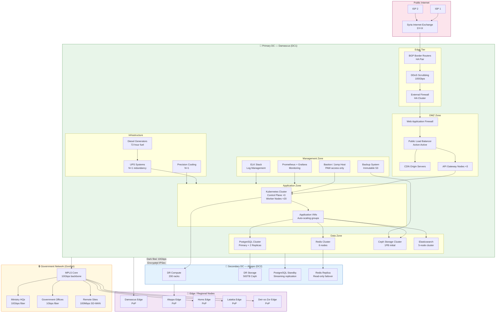
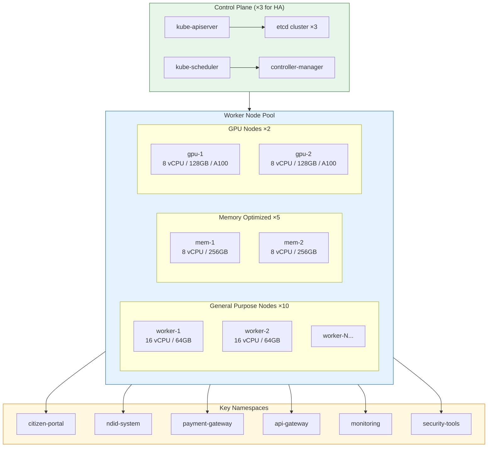
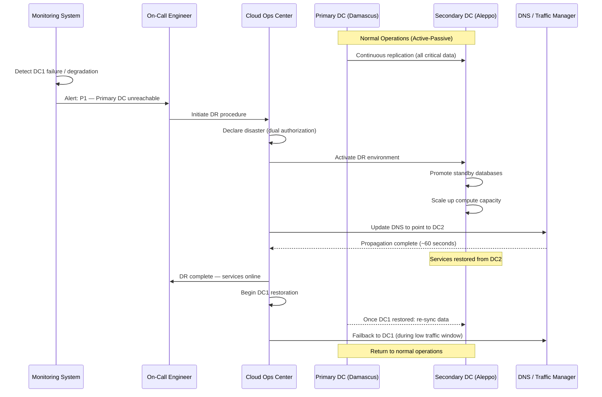

# Government Cloud Topology
**SyriaGovCloud Infrastructure Topology**

## 1. Multi-Site Topology

```mermaid
graph TB
    subgraph INTERNET["Public Internet"]
        ISP1[ISP 1]
        ISP2[ISP 2]
        IXP[Syria Internet Exchange<br/>SY-IX]
    end

    subgraph DC1["🏢 Primary DC — Damascus (DC1)"]
        direction TB
        subgraph DC1_EDGE["Edge Tier"]
            BGP1[BGP Border Routers<br/>HA Pair]
            DDOS1[DDoS Scrubbing<br/>100Gbps]
            FW_EXT1[External Firewall<br/>HA Cluster]
        end

        subgraph DC1_DMZ["DMZ Zone"]
            WAF1[Web Application Firewall]
            LB_PUB1[Public Load Balancer<br/>Active-Active]
            CDN_ORIGIN[CDN Origin Servers]
            API_GW_NODE[API Gateway Nodes ×3]
        end

        subgraph DC1_APP["Application Zone"]
            K8S_CLUSTER1[Kubernetes Cluster<br/>Control Plane ×3<br/>Worker Nodes ×20]
            APP_SERVERS[Application VMs<br/>Auto-scaling groups]
        end

        subgraph DC1_DATA["Data Zone"]
            PG_CLUSTER[PostgreSQL Cluster<br/>Primary + 2 Replicas]
            REDIS_CLUSTER[Redis Cluster<br/>6 nodes]
            CEPH_STORAGE[Ceph Storage Cluster<br/>1PB initial]
            ES_CLUSTER[Elasticsearch<br/>5-node cluster]
        end

        subgraph DC1_MGMT["Management Zone"]
            JUMP[Bastion / Jump Host<br/>PAW access only]
            MON[Prometheus + Grafana<br/>Monitoring]
            LOG[ELK Stack<br/>Log Management]
            BACKUP[Backup System<br/>Immutable S3]
        end

        subgraph DC1_POWER["Infrastructure"]
            UPS1[UPS Systems<br/>N+1 redundancy]
            COOL1[Precision Cooling<br/>N+1]
            GEN1[Diesel Generators<br/>72-hour fuel]
        end
    end

    subgraph DC2["🏢 Secondary DC — Aleppo (DC2)"]
        direction TB
        DR_COMPUTE[DR Compute<br/>200 racks]
        DR_STORAGE[DR Storage<br/>500TB Ceph]
        DR_DB[PostgreSQL Standby<br/>Streaming replication]
        REPLICA_REDIS[Redis Replica<br/>Read-only failover]
    end

    subgraph GOVNET["🔒 Government Network (GovNet)"]
        MPLS_CORE[MPLS Core<br/>10Gbps backbone]
        MINISTRY_HQ[Ministry HQs<br/>10Gbps fiber]
        GOV_OFFICES[Government Offices<br/>1Gbps fiber]
        REMOTE[Remote Sites<br/>100Mbps SD-WAN]
    end

    subgraph EDGE_NODES["📡 Edge / Regional Nodes"]
        EDGE_DAMASCUS[Damascus Edge<br/>PoP]
        EDGE_ALEPPO[Aleppo Edge<br/>PoP]
        EDGE_HOMS[Homs Edge<br/>PoP]
        EDGE_LATAKIA[Latakia Edge<br/>PoP]
        EDGE_DEIR[Deir ez-Zor Edge<br/>PoP]
    end

    ISP1 --> IXP
    ISP2 --> IXP
    IXP --> BGP1
    BGP1 --> DDOS1
    DDOS1 --> FW_EXT1
    FW_EXT1 --> WAF1
    WAF1 --> LB_PUB1
    LB_PUB1 --> CDN_ORIGIN
    LB_PUB1 --> API_GW_NODE
    API_GW_NODE --> K8S_CLUSTER1
    K8S_CLUSTER1 --> APP_SERVERS
    APP_SERVERS --> PG_CLUSTER
    APP_SERVERS --> REDIS_CLUSTER
    APP_SERVERS --> CEPH_STORAGE
    APP_SERVERS --> ES_CLUSTER
    JUMP --> K8S_CLUSTER1
    MON --> DC1_APP
    LOG --> DC1_APP
    BACKUP --> CEPH_STORAGE
    UPS1 --> DC1_APP
    COOL1 --> DC1_APP
    GEN1 --> UPS1

    DC1_DATA --> DR_DB
    DC1_DATA --> DR_STORAGE
    REDIS_CLUSTER --> REPLICA_REDIS
    K8S_CLUSTER1 --> DR_COMPUTE

    DC1 -.->|Dark fiber 10Gbps<br/>Encrypted IPSec| DC2
    DC1 --> MPLS_CORE
    MPLS_CORE --> MINISTRY_HQ
    MPLS_CORE --> GOV_OFFICES
    MPLS_CORE --> REMOTE

    DC1 --> EDGE_DAMASCUS
    DC2 --> EDGE_ALEPPO
    MPLS_CORE --> EDGE_HOMS
    MPLS_CORE --> EDGE_LATAKIA
    MPLS_CORE --> EDGE_DEIR

    style DC1 fill:#e8f5e9,stroke:#2e7d32
    style DC2 fill:#e3f2fd,stroke:#1565c0
    style GOVNET fill:#fff8e1,stroke:#f57f17
    style EDGE_NODES fill:#f3e5f5,stroke:#6a1b9a
    style INTERNET fill:#fce4ec,stroke:#880e4f
```

---

## 2. Kubernetes Cluster Architecture

```mermaid
graph TB
    subgraph CONTROL_PLANE["Control Plane (×3 for HA)"]
        API_SERVER[kube-apiserver]
        SCHEDULER[kube-scheduler]
        CTRL_MGR[controller-manager]
        ETCD[etcd cluster ×3]
    end

    subgraph WORKER_NODES["Worker Node Pool"]
        subgraph GENERAL["General Purpose Nodes ×10"]
            WN1[worker-1<br/>16 vCPU / 64GB]
            WN2[worker-2<br/>16 vCPU / 64GB]
            WN_N[worker-N...]
        end
        subgraph MEMORY["Memory Optimized ×5"]
            MN1[mem-1<br/>8 vCPU / 256GB]
            MN2[mem-2<br/>8 vCPU / 256GB]
        end
        subgraph GPU_NODES["GPU Nodes ×2"]
            GPU1[gpu-1<br/>8 vCPU / 128GB / A100]
            GPU2[gpu-2<br/>8 vCPU / 128GB / A100]
        end
    end

    subgraph NAMESPACES["Key Namespaces"]
        NS_CITIZEN[citizen-portal]
        NS_NDID[ndid-system]
        NS_PAYMENT[payment-gateway]
        NS_API_GW[api-gateway]
        NS_MONITORING[monitoring]
        NS_SECURITY[security-tools]
    end

    CONTROL_PLANE --> WORKER_NODES
    API_SERVER --> ETCD
    SCHEDULER --> CTRL_MGR
    WORKER_NODES --> NS_CITIZEN
    WORKER_NODES --> NS_NDID
    WORKER_NODES --> NS_PAYMENT
    WORKER_NODES --> NS_API_GW
    WORKER_NODES --> NS_MONITORING
    WORKER_NODES --> NS_SECURITY

    style CONTROL_PLANE fill:#e8f5e9,stroke:#2e7d32
    style WORKER_NODES fill:#e3f2fd,stroke:#1565c0
    style NAMESPACES fill:#fff8e1,stroke:#f57f17
```

---

## 3. Disaster Recovery Flow

```mermaid
sequenceDiagram
    participant MON as Monitoring System
    participant ONCALL as On-Call Engineer
    participant GCOC as Cloud Ops Center
    participant DC1 as Primary DC (Damascus)
    participant DC2 as Secondary DC (Aleppo)
    participant DNS as DNS / Traffic Manager

    Note over DC1,DC2: Normal Operations (Active-Passive)

    DC1->>DC2: Continuous replication (all critical data)
    MON->>MON: Detect DC1 failure / degradation
    MON->>ONCALL: Alert: P1 — Primary DC unreachable
    ONCALL->>GCOC: Initiate DR procedure
    GCOC->>GCOC: Declare disaster (dual authorization)
    GCOC->>DC2: Activate DR environment
    DC2->>DC2: Promote standby databases
    DC2->>DC2: Scale up compute capacity
    GCOC->>DNS: Update DNS to point to DC2
    DNS-->>GCOC: Propagation complete (~60 seconds)
    Note over DC2: Services restored from DC2
    GCOC->>ONCALL: DR complete — services online
    GCOC->>GCOC: Begin DC1 restoration
    DC1-->>DC2: Once DC1 restored: re-sync data
    GCOC->>DNS: Failback to DC1 (during low traffic window)
    Note over DC1,DC2: Return to normal operations
```
