# National Digital Government Architecture
**Digital Syria Vision — High-Level Architecture**

```mermaid
graph TB
    subgraph CITIZENS["👥 Citizens & Businesses"]
        CIT[Citizens]
        BIZ[Businesses]
        GOV_PARTNER[International Partners]
    end

    subgraph CHANNELS["📱 Access Channels"]
        PORTAL[portal.gov.sy<br/>Citizen Web Portal]
        MOBILE[Syria Gov App<br/>Mobile Application]
        KIOSK[Government Kiosks<br/>Service Centers]
        SMS_USSD[SMS / USSD<br/>Feature Phones]
    end

    subgraph GATEWAY_LAYER["🔐 Gateway & Security Layer"]
        WAF[WAF / DDoS Protection]
        CDN[Content Delivery Network]
        API_GW[National API Gateway<br/>Authentication • Authorization • Rate Limiting]
        NDID_SVC[National Digital Identity<br/>Service NDID]
    end

    subgraph PLATFORM_SERVICES["⚙️ Core Platform Services"]
        NOTIFY[Notification Service<br/>SMS • Email • Push]
        PAYMENT[Government Payment<br/>Gateway GPG]
        SEARCH[National Search<br/>Service]
        TRANSLATE[Arabic/English<br/>Translation Service]
        AUDIT[Audit & Logging<br/>Service]
        WORKFLOW[Workflow<br/>Engine]
    end

    subgraph MINISTRY_SYSTEMS["🏛️ Ministry Digital Systems"]
        MOI[Ministry of Interior<br/>ID • Civil Registry • Passports]
        MOH[Ministry of Health<br/>eHealth • Medical Records]
        MOE[Ministry of Education<br/>Enrollment • Certificates]
        MOF[Ministry of Finance<br/>Tax • Customs]
        MOJ[Ministry of Justice<br/>Courts • Legal Services]
        MORE[Other Ministries ×25]
    end

    subgraph DATA_LAYER["🗄️ Master Data & Registries"]
        CITIZEN_REG[Citizen Master Registry<br/>Authoritative Citizen Records]
        BIZ_REG[Business Registry]
        PROP_REG[Property Registry]
        DATA_LAKE[Government Data Lake<br/>Analytics Platform]
        OPEN_DATA[Open Data Portal<br/>data.gov.sy]
    end

    subgraph INFRA["☁️ SyriaGovCloud Infrastructure"]
        DC1[Primary Data Center<br/>Damascus — Tier III]
        DC2[DR Data Center<br/>Aleppo — Tier III]
        GOVNET[Government Network<br/>GovNet — MPLS Encrypted]
    end

    subgraph SECURITY["🛡️ Security Operations"]
        SYCERT[SY-CERT<br/>National CERT]
        SOC[Government SOC<br/>24/7 Monitoring]
        SIEM[SIEM Platform<br/>Security Analytics]
    end

    CIT --> PORTAL
    CIT --> MOBILE
    CIT --> KIOSK
    CIT --> SMS_USSD
    BIZ --> PORTAL
    BIZ --> API_GW

    PORTAL --> WAF
    MOBILE --> WAF
    KIOSK --> WAF
    SMS_USSD --> API_GW

    WAF --> CDN
    CDN --> API_GW
    API_GW --> NDID_SVC

    API_GW --> NOTIFY
    API_GW --> PAYMENT
    API_GW --> WORKFLOW
    API_GW --> AUDIT

    API_GW --> MOI
    API_GW --> MOH
    API_GW --> MOE
    API_GW --> MOF
    API_GW --> MOJ
    API_GW --> MORE

    MOI --> CITIZEN_REG
    MOI --> PROP_REG
    MOE --> BIZ_REG
    MOF --> BIZ_REG

    CITIZEN_REG --> DATA_LAKE
    BIZ_REG --> DATA_LAKE
    DATA_LAKE --> OPEN_DATA

    MOI --> DC1
    MOH --> DC1
    MOE --> DC1
    PAYMENT --> DC1
    NDID_SVC --> DC1
    DC1 --> DC2
    DC1 --> GOVNET
    DC2 --> GOVNET

    SOC --> SIEM
    SYCERT --> SOC
    SIEM --> DC1

    style CITIZENS fill:#e3f2fd,stroke:#1565c0
    style CHANNELS fill:#f3e5f5,stroke:#6a1b9a
    style GATEWAY_LAYER fill:#fce4ec,stroke:#880e4f
    style PLATFORM_SERVICES fill:#e8f5e9,stroke:#1b5e20
    style MINISTRY_SYSTEMS fill:#fff8e1,stroke:#f57f17
    style DATA_LAYER fill:#e0f2f1,stroke:#004d40
    style INFRA fill:#e8eaf6,stroke:#283593
    style SECURITY fill:#fbe9e7,stroke:#bf360c
```

## Architecture Overview

The national digital government architecture is built on five foundational principles:

1. **Single Gateway:** All citizen-facing services route through the National API Gateway, ensuring consistent authentication, authorization, and monitoring.

2. **Federated Services:** Ministries maintain ownership of their services but expose them via standardized APIs. The API Gateway handles integration.

3. **Authoritative Data:** Master registries (citizen, business, property) serve as single sources of truth. No duplication of data across ministries.

4. **Sovereign Infrastructure:** All components run on SyriaGovCloud infrastructure within Syrian territory.

5. **Security by Design:** Every layer includes security controls. SY-CERT and Government SOC provide 24/7 monitoring across all systems.
